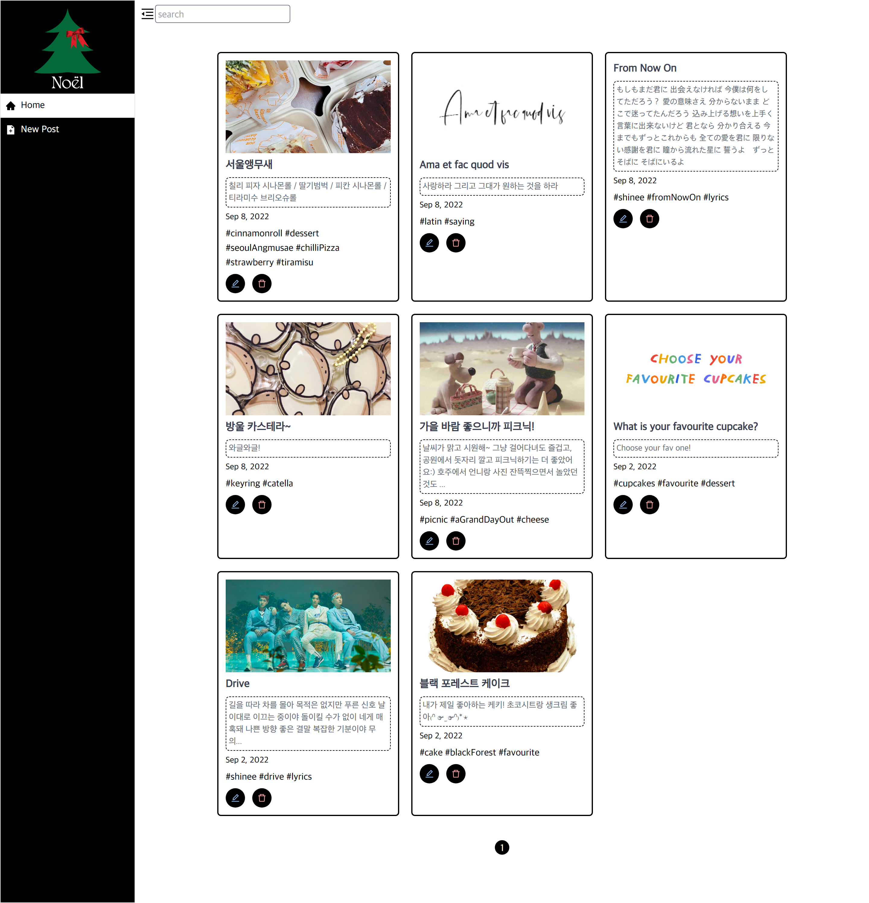
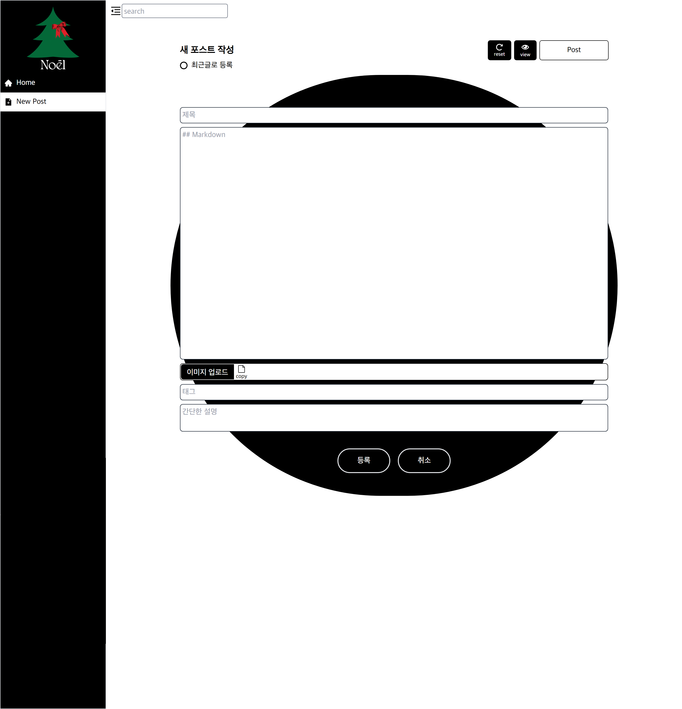

<!--
# my-another-blog
    [](https://github.com/salutJuillet/my-another-blog)
-->


<!-- ABOUT THE PROJECT -->
# my-another-blog

<div align="center">
  
   <br/>
  <a href="https://youtu.be/zdW7J8rPsVU" target="_blank">https://youtu.be/zdW7J8rPsVU</a>
</div> <br/><br/>

아끼는 두 번 블로그입니다! 자유롭게 포스트 작성, 수정, 삭제가 가능합니다.
<br/><br/>


## Built With

[][React-url]  
[][NodeJS-url]  
[][MongoDB-url]  
[][TailwindCSS-url]
<br/><br/>


<!-- GETTING STARTED -->
## Getting Started

### Prerequisites

Before installation you have to import blog posts data using mongoimport. Follow the [Database Tools Installation Guide](https://www.mongodb.com/docs/database-tools/installation/installation/) to install 
mongoimport.


### Installation

1. Clone the repo
   ```sh
   git clone https://github.com/salutJuillet/my-another-blog.git
   ```
2. Open command line and change current working directory to the cloned reposistory directory
3. Import data
   ```sh
   mongoimport --db myblog --collection posts --file admin\public\data\myanotherblog_posts.json --port 27017
   mongoimport --db myblog --collection featuredposts --file admin\public\data\myanotherblog_posts.json --port 27017
   ```
4. Install packages using npm
   ```sh
   npm install
   ```
   
   or yarn
   ```sh
   yarn
   ```
5. Run commands below in terminal using npm
   ```sh
   cd admin
   npm run dev
   ```
   or yarn
   ```sh
   cd admin
   yarn dev
   ```
<br/>


<!-- USAGE EXAMPLES -->
<!--
	# Usage
	Use this space to show useful examples of how a project can be used. Additional screenshots, code examples and demos work well in this space. You may also link to more resources.
-->


<!-- CONTRIBUTING -->
## Contributing

Contributions are what make the open source community such an amazing place to learn, inspire, and create. Any contributions you make are **greatly appreciated**.

If you have a suggestion that would make this better, please fork the repo and create a pull request. You can also simply open an issue with the tag "enhancement".
Don't forget to give the project a star! Thanks again!

1. Fork the Project
2. Create your Feature Branch (`git checkout -b feature/AmazingFeature`)
3. Commit your Changes (`git commit -m 'Add some AmazingFeature'`)
4. Push to the Branch (`git push origin feature/AmazingFeature`)
5. Open a Pull Request
<br/>


<!-- CONTACT -->
## Contact

 salut.juilllet@gmail.com


 [https://github.com/salutJuillet](https://github.com/salutJuillet)


<!-- MARKDOWN LINKS & IMAGES -->
<!-- https://www.markdownguide.org/basic-syntax/#reference-style-links -->
[React-url]: https://reactjs.org/
[NodeJS-url]: https://nodejs.org/
[MongoDB-url]: https://www.mongodb.com/
[TailwindCSS-url]: https://tailwindcss.com/
